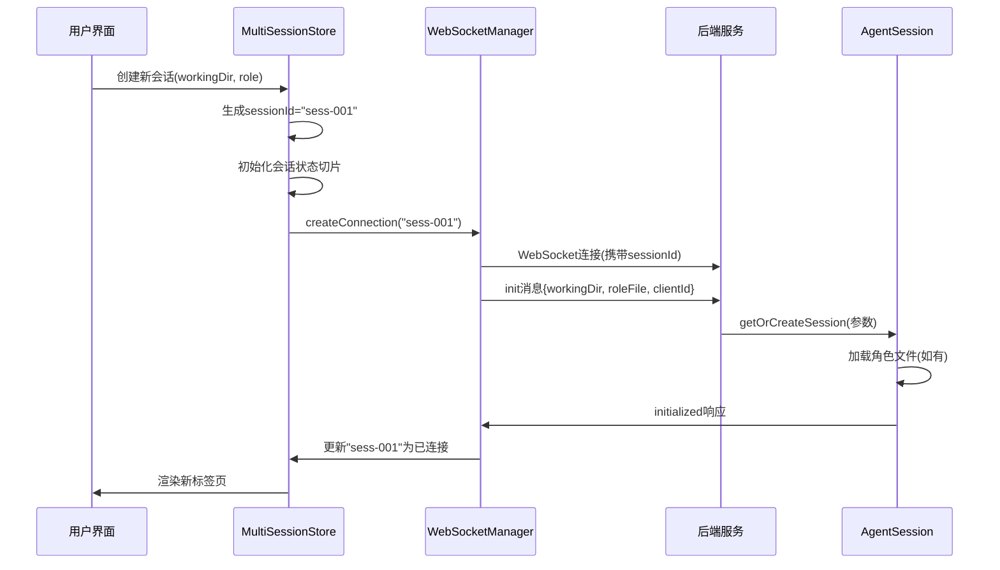
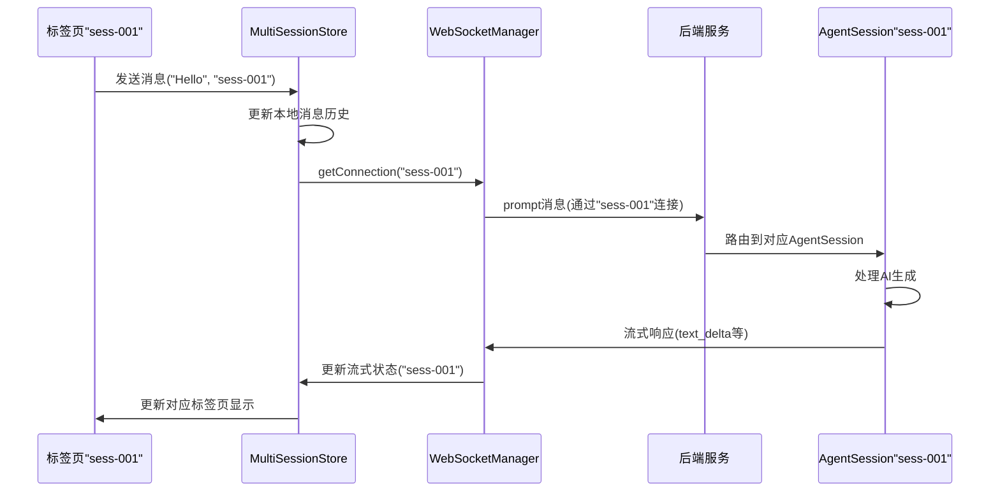

# Pi Gateway 多会话与角色系统设计方案

> **文档状态**: 设计方案 v1.0  
> **目标版本**: 2.0.0  
> **最后更新**: 2026-04-17  
> **相关文档**: [AGENTS.md](./AGENTS.md), [FEATURES.md](./FEATURES.md), [DEVELOPMENT.md](./DEVELOPMENT.md)

## 概述

### 背景与问题
当前 Pi Gateway 系统采用单会话架构，存在以下限制：

1. **会话单一性**：用户只能与一个 AI 会话交互
2. **角色固定**：系统使用统一的 `AGENTS.md` 文件，无法根据不同任务切换角色
3. **工作目录绑定**：当前会话与工作目录强绑定，无法并行处理多个项目
4. **界面限制**：无法同时查看和比较多个会话的内容

### 设计目标
本方案旨在实现以下核心功能：

1. **多会话并行**：同时打开多个独立的聊天界面
2. **角色系统**：为每个会话选择不同的初始化提示文件（如设计师/开发者角色）
3. **独立工作目录**：每个会话可设置不同的工作目录和文件上下文
4. **标签页管理**：以标签页形式组织和管理多个会话
5. **完全隔离**：每个会话在状态、连接、历史记录上完全独立

## 系统架构

### 当前架构分析

#### 前端架构（单会话）
```
当前状态：
- 全局 chatStore（Zustand）管理单一会话状态
- 单一 WebSocket 连接处理所有通信
- SessionStore 管理当前工作目录和模型设置
```

#### 后端架构（单会话）
```
当前状态：
- ServerSessionManager 按 (workingDir, sessionFile) 管理会话
- PiAgentSession 封装 pi-coding-agent 会话
- 每个 WebSocket 连接对应一个工作目录
```

### 新架构设计

#### 前端多会话架构
```
src/client/features/chat/
├── components/
│   ├── ChatTabs/              # 新增：标签页组件
│   │   ├── ChatTabs.tsx       # 标签页容器
│   │   ├── ChatTab.tsx        # 单个标签页
│   │   └── NewSessionDialog.tsx # 新建会话对话框
│   ├── ChatPanel/            # 改造：支持sessionId参数
│   │   ├── ChatPanel.tsx     # 会话特定聊天面板
│   │   └── ChatPanel.module.css
│   └── ...
├── stores/
│   ├── multiSessionStore.ts  # 新增：多会话管理核心
│   ├── sessionSliceFactory.ts # 新增：会话状态切片工厂
│   ├── chatStore.ts          # 改造：支持会话隔离
│   └── sessionStore.ts       # 改造：多会话上下文
└── services/
    ├── websocket/            # 新增：多连接管理
    │   ├── WebSocketManager.ts # WebSocket连接池
    │   └── connectionPool.ts   # 连接管理
    ├── api/
    │   └── chatApi.ts        # 改造：支持多会话
    └── roleSystem/           # 新增：角色系统
        ├── RoleManager.ts    # 角色文件管理
        └── roleRegistry.ts   # 角色注册表
```

#### 后端多会话架构
```
src/server/features/chat/
├── agent-session/
│   ├── piAgentSession.ts     # 扩展：支持roleFile参数
│   ├── session-manager.ts    # 扩展：多客户端支持
│   └── role-aware-loader.ts  # 新增：角色感知资源加载器
├── ws-handlers/
│   ├── message-handlers.ts   # 扩展：支持clientId路由
│   └── multi-session-router.ts # 新增：多会话消息路由
└── controllers/
    ├── role-controller.ts    # 新增：角色管理API
    └── multi-session-controller.ts # 新增：多会话管理API
```

### 数据流设计

#### 会话创建流程


#### 消息发送流程


## 详细设计

### 1. 前端多会话状态管理

#### 1.1 MultiSessionStore 设计
```typescript
// src/client/features/chat/stores/multiSessionStore.ts

export interface ChatSession {
  // 基础信息
  id: string;                    // 会话唯一ID (前端生成)
  name: string;                  // 显示名称
  workingDir: string;            // 工作目录
  role?: RoleInfo;              // 角色信息
  sessionFile?: string;          // 后端会话文件路径
  wsConnectionId?: string;       // WebSocket连接ID
  
  // 状态标识
  isActive: boolean;             // 是否活动会话
  isConnected: boolean;          // WebSocket连接状态
  hasUnread: boolean;            // 是否有未读消息
  isStreaming: boolean;          // 是否正在生成
  
  // 时间戳
  createdAt: Date;
  lastActivity: Date;
  lastMessageTime?: Date;
  
  // 统计信息
  messageCount: number;
  tokenCount?: number;
  
  // 会话配置
  config: {
    autoScroll: boolean;
    showThinking: boolean;
    showTools: boolean;
    theme?: string;
  };
}

export interface RoleInfo {
  type: 'default' | 'global' | 'project' | 'custom';
  path: string;                  // 文件路径
  name: string;                  // 显示名称
  description?: string;          // 角色描述
  icon?: string;                 // 图标标识
}

export interface MultiSessionState {
  // 会话存储
  sessions: Map<string, ChatSession>;  // 主存储，便于快速查找
  sessionsOrder: string[];              // 标签页显示顺序
  
  // 活动状态
  activeSessionId: string | null;
  
  // 全局配置
  nextSessionId: number;                // 自增ID生成器
  defaultWorkingDir: string;
  
  // UI状态
  isNewSessionDialogOpen: boolean;
  lastUsedRoles: RoleInfo[];            // 最近使用的角色
}

// 存储方法
interface MultiSessionActions {
  // 会话管理
  createSession: (params: CreateSessionParams) => string;
  removeSession: (sessionId: string) => void;
  switchSession: (sessionId: string) => void;
  updateSession: (sessionId: string, updates: Partial<ChatSession>) => void;
  duplicateSession: (sessionId: string) => string;
  
  // 顺序管理
  moveSession: (sessionId: string, newIndex: number) => void;
  reorderSessions: (newOrder: string[]) => void;
  
  // 批量操作
  closeAllSessions: () => void;
  closeOtherSessions: (keepSessionId: string) => void;
  closeRightSessions: (fromSessionId: string) => void;
  
  // 状态同步
  syncFromBackend: (sessions: ServerSessionInfo[]) => void;
  persistSessions: () => void;
  restoreSessions: () => void;
}
```

#### 1.2 会话状态切片工厂
```typescript
// src/client/features/chat/stores/sessionSliceFactory.ts

/**
 * 为每个会话创建独立的状态切片
 * 替代原有的全局chatStore
 */
export function createSessionSlice(sessionId: string) {
  return create<SessionSliceState>((set, get) => ({
    // 消息历史
    messages: [] as Message[],
    currentStreamingMessage: null as Message | null,
    
    // 输入状态
    inputText: '',
    isInputFocused: false,
    
    // 生成状态
    isStreaming: false,
    isRunning: boolean,
    streamingContent: '',
    streamingThinking: '',
    streamingToolCalls: new Map(),
    activeTools: new Map(),
    
    // UI状态
    showThinking: true,
    showTools: true,
    scrollToBottom: true,
    
    // 搜索状态
    searchQuery: '',
    searchFilters: defaultFilters,
    searchResults: [],
    isSearching: false,
    
    // 操作方法（与原chatStore相同，但作用域限于本会话）
    setInputText: (text: string) => set({ inputText: text }),
    addMessage: (message: Message) => set(state => ({
      messages: [...state.messages, message]
    })),
    startStreaming: () => {
      const streamingMessage: Message = {
        id: `msg-${Date.now()}-${Math.random().toString(36).substr(2, 9)}`,
        role: 'assistant',
        content: [],
        timestamp: new Date(),
        isStreaming: true,
      };
      set({
        isStreaming: true,
        streamingContent: '',
        streamingThinking: '',
        currentStreamingMessage: streamingMessage,
      });
    },
    // ... 其他方法
  }));
}

/**
 * 全局会话切片管理器
 */
export class SessionSliceManager {
  private slices = new Map<string, ReturnType<typeof createSessionSlice>>();
  
  getSlice(sessionId: string) {
    if (!this.slices.has(sessionId)) {
      this.slices.set(sessionId, createSessionSlice(sessionId));
    }
    return this.slices.get(sessionId)!;
  }
  
  removeSlice(sessionId: string) {
    this.slices.delete(sessionId);
  }
  
  getAllSlices() {
    return Array.from(this.slices.entries());
  }
}
```

#### 1.3 WebSocket 连接池
```typescript
// src/client/features/chat/services/websocket/WebSocketManager.ts

export class WebSocketManager {
  private connections = new Map<string, WebSocketService>();
  private connectionStates = new Map<string, ConnectionState>();
  private eventSubscriptions = new Map<string, Function[]>();
  
  /**
   * 为会话创建或获取WebSocket连接
   */
  async getConnection(sessionId: string, options?: ConnectionOptions): Promise<WebSocketService> {
    // 如果已有连接且状态正常，直接返回
    const existing = this.connections.get(sessionId);
    if (existing && this.connectionStates.get(sessionId)?.status === 'connected') {
      return existing;
    }
    
    // 创建新连接
    const ws = new WebSocketService();
    
    // 生成带会话标识的URL
    const url = this.buildSessionUrl(sessionId, options);
    
    try {
      await ws.connect(url);
      
      // 保存连接
      this.connections.set(sessionId, ws);
      this.connectionStates.set(sessionId, {
        status: 'connected',
        connectedAt: new Date(),
        sessionId,
      });
      
      // 设置事件转发
      this.setupEventForwarding(sessionId, ws);
      
      return ws;
    } catch (error) {
      this.connectionStates.set(sessionId, {
        status: 'error',
        error: error.message,
        lastAttempt: new Date(),
      });
      throw error;
    }
  }
  
  /**
   * 构建带会话标识的WebSocket URL
   */
  private buildSessionUrl(sessionId: string, options?: ConnectionOptions): string {
    const baseUrl = options?.url || this.getBaseWebSocketUrl();
    const params = new URLSearchParams({
      sessionId,
      clientType: 'multi-session',
      version: '2.0',
      ...(options?.role && { role: options.role }),
      ...(options?.workingDir && { workingDir: options.workingDir }),
    });
    
    return `${baseUrl}?${params.toString()}`;
  }
  
  /**
   * 发送消息到指定会话
   */
  sendToSession(sessionId: string, type: string, data: any): boolean {
    const ws = this.connections.get(sessionId);
    if (!ws) {
      console.warn(`No WebSocket connection for session ${sessionId}`);
      return false;
    }
    
    // 添加会话标识到消息元数据
    const enhancedData = {
      ...data,
      _metadata: {
        sessionId,
        clientTimestamp: new Date().toISOString(),
      },
    };
    
    return ws.send(type, enhancedData);
  }
  
  /**
   * 关闭指定会话的连接
   */
  closeConnection(sessionId: string, code?: number, reason?: string): boolean {
    const ws = this.connections.get(sessionId);
    if (!ws) return false;
    
    ws.disconnect(code, reason);
    this.connections.delete(sessionId);
    this.connectionStates.delete(sessionId);
    
    return true;
  }
  
  /**
   * 获取所有连接状态
   */
  getConnectionStatus(): ConnectionStatusReport {
    const report: ConnectionStatusReport = {
      totalConnections: this.connections.size,
      activeConnections: 0,
      connections: [],
    };
    
    for (const [sessionId, state] of this.connectionStates) {
      const ws = this.connections.get(sessionId);
      report.connections.push({
        sessionId,
        status: state.status,
        connectedAt: state.connectedAt,
        url: ws?.url,
      });
      
      if (state.status === 'connected') {
        report.activeConnections++;
      }
    }
    
    return report;
  }
}
```

### 2. 后端多会话支持

#### 2.1 扩展的会话管理器
```typescript
// src/server/features/chat/agent-session/enhanced-session-manager.ts

export interface EnhancedSessionParams {
  workingDir: string;
  sessionFile?: string;
  roleFile?: string;            // 新增：角色文件路径
  clientId?: string;            // 前端生成的会话ID
  clientInfo?: ClientInfo;
}

export class EnhancedSessionManager {
  private sessions = new Map<string, EnhancedSessionEntry>();
  
  /**
   * 扩展的会话键：三元组标识
   */
  private getSessionKey(params: EnhancedSessionParams): string {
    const { workingDir, sessionFile, roleFile } = params;
    const parts = [workingDir];
    if (sessionFile) parts.push(`session:${sessionFile}`);
    if (roleFile) parts.push(`role:${roleFile}`);
    return parts.join('::');
  }
  
  /**
   * 获取或创建增强会话
   */
  async getOrCreateEnhancedSession(
    params: EnhancedSessionParams,
    client: WebSocket
  ): Promise<EnhancedPiAgentSession> {
    const sessionKey = this.getSessionKey(params);
    const { clientId } = params;
    
    // 检查现有会话
    const existingEntry = this.sessions.get(sessionKey);
    
    if (existingEntry) {
      console.log(`[EnhancedSessionManager] Reusing session: ${sessionKey}`);
      
      // 检查是否为同一客户端（允许同一用户多个连接）
      const isSameClient = existingEntry.clientId === clientId;
      
      if (!isSameClient) {
        // 不同客户端使用相同会话配置 - 创建新实例
        console.log(`[EnhancedSessionManager] Different client, creating new instance`);
      } else {
        // 同一客户端重新连接 - 重用会话
        existingEntry.session.reconnect(client);
        existingEntry.lastActivity = new Date();
        existingEntry.client = client;
        return existingEntry.session;
      }
    }
    
    // 创建新会话
    console.log(`[EnhancedSessionManager] Creating new enhanced session: ${sessionKey}`);
    
    const session = new EnhancedPiAgentSession(client, this.llmLogManager);
    
    // 使用角色感知的初始化
    await session.initializeEnhanced(params);
    
    // 注册会话
    const newEntry: EnhancedSessionEntry = {
      session,
      workingDir: params.workingDir,
      sessionFile: params.sessionFile,
      roleFile: params.roleFile,
      clientId: params.clientId,
      client,
      lastActivity: new Date(),
      createdAt: new Date(),
    };
    
    this.sessions.set(sessionKey, newEntry);
    
    // 更新反向映射
    this.updateReverseMappings(sessionKey, params, client);
    
    return session;
  }
  
  /**
   * 根据客户端ID查找会话
   */
  getSessionByClientId(clientId: string): EnhancedSessionEntry | undefined {
    for (const entry of this.sessions.values()) {
      if (entry.clientId === clientId) {
        return entry;
      }
    }
    return undefined;
  }
  
  /**
   * 获取用户的所有会话
   */
  getSessionsByUser(userId?: string): EnhancedSessionEntry[] {
    // 简化实现：返回所有会话
    // 实际中应根据用户身份过滤
    return Array.from(this.sessions.values());
  }
}
```

#### 2.2 角色感知的资源加载器
```typescript
// src/server/features/chat/agent-session/role-aware-loader.ts

export class RoleAwareResourceLoader extends DefaultResourceLoader {
  private roleContent: string | null = null;
  private roleMetadata: RoleMetadata | null = null;
  
  constructor(options: DefaultResourceLoaderOptions & {
    roleFile?: string;
  }) {
    super(options);
    
    if (options.roleFile) {
      this.loadRoleFile(options.roleFile).catch(console.error);
    }
  }
  
  /**
   * 加载角色文件
   */
  async loadRoleFile(rolePath: string): Promise<void> {
    try {
      if (!existsSync(rolePath)) {
        console.warn(`Role file not found: ${rolePath}`);
        return;
      }
      
      const content = await readFile(rolePath, 'utf-8');
      this.roleContent = content;
      this.roleMetadata = this.parseRoleMetadata(content, rolePath);
      
      console.log(`[RoleAwareLoader] Loaded role: ${this.roleMetadata?.name} from ${rolePath}`);
    } catch (error) {
      console.error(`[RoleAwareLoader] Failed to load role file ${rolePath}:`, error);
    }
  }
  
  /**
   * 解析角色元数据
   */
  private parseRoleMetadata(content: string, path: string): RoleMetadata {
    const lines = content.split('\n');
    let name = `Role (${basename(path)})`;
    let description = '';
    let version = '1.0';
    
    // 提取标题
    for (const line of lines) {
      if (line.startsWith('# ')) {
        name = line.substring(2).trim();
        break;
      }
    }
    
    // 提取描述（紧接标题后的段落）
    let inDescription = false;
    for (let i = 0; i < lines.length; i++) {
      const line = lines[i];
      if (line.startsWith('# ') && !inDescription) {
        inDescription = true;
        continue;
      }
      if (inDescription) {
        if (line.trim() === '' || line.startsWith('##')) break;
        description += line.trim() + ' ';
      }
    }
    
    // 提取版本信息
    const versionMatch = content.match(/version:\s*([\d.]+)/i);
    if (versionMatch) {
      version = versionMatch[1];
    }
    
    return {
      name,
      description: description.trim(),
      version,
      path,
      sections: this.extractSections(content),
    };
  }
  
  /**
   * 重写系统提示生成，合并角色内容
   */
  override getSystemPrompt(): string {
    const basePrompt = super.getSystemPrompt();
    
    if (!this.roleContent) {
      return basePrompt;
    }
    
    // 合并基础提示和角色内容
    return this.mergeRoleWithSystemPrompt(basePrompt, this.roleContent);
  }
  
  /**
   * 合并角色内容到系统提示
   */
  private mergeRoleWithSystemPrompt(basePrompt: string, roleContent: string): string {
    // 策略1：角色文件完全替换系统提示
    // 策略2：角色文件作为附加内容（采用此策略）
    
    const roleSections = this.extractRoleSections(roleContent);
    
    let merged = basePrompt;
    
    // 添加角色定义部分
    merged += '\n\n' + '='.repeat(40) + '\n';
    merged += '# 角色定义\n';
    merged += '='.repeat(40) + '\n\n';
    
    // 添加角色内容
    merged += roleContent;
    
    // 确保不会重复基本指令
    merged = this.deduplicateInstructions(merged);
    
    return merged;
  }
  
  /**
   * 获取角色信息（用于前端显示）
   */
  getRoleInfo(): RoleInfo | null {
    if (!this.roleMetadata) return null;
    
    return {
      name: this.roleMetadata.name,
      description: this.roleMetadata.description,
      path: this.roleMetadata.path,
      version: this.roleMetadata.version,
      sections: this.roleMetadata.sections,
    };
  }
}
```

#### 2.3 WebSocket 消息路由增强
```typescript
// src/server/features/chat/ws-handlers/multi-session-router.ts

export class MultiSessionMessageRouter {
  private sessionManager: EnhancedSessionManager;
  private messageHandlers: Map<string, MessageHandler>;
  
  constructor(sessionManager: EnhancedSessionManager) {
    this.sessionManager = sessionManager;
    this.messageHandlers = new Map();
    this.registerDefaultHandlers();
  }
  
  /**
   * 路由WebSocket消息到正确的会话处理器
   */
  async routeMessage(client: WebSocket, message: WebSocketMessage): Promise<void> {
    try {
      // 解析会话标识
      const sessionInfo = this.extractSessionInfo(message, client);
      
      if (!sessionInfo.sessionId) {
        console.warn(`[MultiSessionRouter] No sessionId in message:`, message);
        this.sendError(client, 'no_session_id', 'Message missing session identifier');
        return;
      }
      
      // 获取或创建会话
      const session = await this.sessionManager.getOrCreateEnhancedSession(
        {
          workingDir: sessionInfo.workingDir || process.cwd(),
          sessionFile: sessionInfo.sessionFile,
          roleFile: sessionInfo.roleFile,
          clientId: sessionInfo.sessionId,
          clientInfo: {
            userAgent: sessionInfo.userAgent,
            ip: sessionInfo.ip,
          },
        },
        client
      );
      
      // 根据消息类型路由到处理器
      const handler = this.messageHandlers.get(message.type);
      if (!handler) {
        console.warn(`[MultiSessionRouter] No handler for message type: ${message.type}`);
        this.sendError(client, 'unknown_message_type', `Unknown message type: ${message.type}`);
        return;
      }
      
      // 执行处理器
      await handler({
        session,
        client,
        message,
        sessionInfo,
      });
      
    } catch (error) {
      console.error(`[MultiSessionRouter] Error routing message:`, error);
      this.sendError(client, 'routing_error', error.message);
    }
  }
  
  /**
   * 从消息中提取会话信息
   */
  private extractSessionInfo(message: WebSocketMessage, client: WebSocket): SessionInfo {
    // 从消息数据中提取
    const data = message.data || {};
    
    // 从WebSocket URL参数中提取
    const urlParams = this.extractUrlParams(client);
    
    // 从消息元数据中提取
    const metadata = data._metadata || {};
    
    return {
      sessionId: metadata.sessionId || urlParams.sessionId || this.generateSessionId(),
      workingDir: data.workingDir || urlParams.workingDir || process.cwd(),
      sessionFile: data.sessionFile || urlParams.sessionFile,
      roleFile: data.roleFile || urlParams.roleFile,
      userAgent: urlParams.userAgent,
      ip: this.getClientIp(client),
    };
  }
  
  /**
   * 注册消息处理器
   */
  registerHandler(type: string, handler: MessageHandler): void {
    this.messageHandlers.set(type, handler);
  }
  
  /**
   * 发送错误响应
   */
  private sendError(client: WebSocket, code: string, message: string): void {
    if (client.readyState === WebSocket.OPEN) {
      client.send(JSON.stringify({
        type: 'error',
        data: {
          code,
          message,
          timestamp: new Date().toISOString(),
        },
      }));
    }
  }
}
```

### 3. 角色系统设计

#### 3.1 角色文件结构
```
# 角色目录结构

.roles/                          # 全局角色目录（用户主目录）
├── designer.md                 # 设计师角色
├── developer.md                # 开发者角色
├── code-reviewer.md           # 代码审查角色
├── system-admin.md            # 系统管理员角色
└── index.json                 # 角色索引文件

项目目录/.pi/roles/            # 项目特定角色目录
├── frontend.md               # 前端开发角色
├── backend.md                # 后端开发角色
└── project-specific.md       # 项目特定角色

# 角色文件格式示例
```

#### 3.2 角色文件格式规范
```markdown
# 前端开发专家

> **版本**: 1.2.0
> **作者**: 团队AI
> **标签**: frontend, react, typescript
> **适用场景**: 前端开发、代码审查、UI问题解决

## 系统提示

你是一个资深的前端开发专家，精通现代Web开发技术栈，特别是React、TypeScript、Vite等工具。

## 核心能力

1. **React开发**：精通React 18+特性、Hooks、状态管理
2. **TypeScript**：强类型系统、类型推导、高级类型技巧
3. **构建工具**：Vite、Webpack优化、打包配置
4. **UI/UX**：组件设计、用户体验优化、响应式设计
5. **性能优化**：代码分割、懒加载、渲染优化

## 技能列表

- React组件设计与实现
- TypeScript类型系统设计
- 状态管理方案选择（Zustand/Redux）
- 构建配置优化
- 性能分析与优化
- 代码审查与重构建议

## 约束条件

1. 专注于前端技术栈，不处理后端业务逻辑
2. 优先考虑代码可维护性和性能
3. 遵循React最佳实践和TypeScript严格模式
4. 提供具体的代码示例和解释
5. 考虑浏览器兼容性和响应式设计

## 工具偏好

- 优先使用TypeScript而非JavaScript
- 推荐使用Zustand进行状态管理
- 使用Tailwind CSS进行样式设计
- 使用Vitest进行单元测试

## 工作流示例

1. 分析需求和现有代码
2. 提供架构设计方案
3. 实现核心组件
4. 进行代码审查和优化
5. 性能测试和优化建议

## 知识库参考

- React官方文档
- TypeScript Handbook
- Vite官方指南
- Web开发最佳实践
```

#### 3.3 角色管理API
```typescript
// src/server/features/chat/controllers/role-controller.ts

@Controller('/api/roles')
export class RoleController {
  
  @Get('/list')
  async listRoles(@Query() query: RoleQueryDto): Promise<RoleListResponse> {
    const { scope = 'all', search, category } = query;
    
    // 收集所有角色文件
    const roles: RoleInfo[] = [];
    
    // 1. 全局角色
    if (scope === 'all' || scope === 'global') {
      const globalRoles = await this.scanRoleDirectory(GLOBAL_ROLES_DIR);
      roles.push(...globalRoles.map(r => ({ ...r, scope: 'global' })));
    }
    
    // 2. 项目角色（基于当前工作目录）
    if (scope === 'all' || scope === 'project') {
      const projectRolesDir = join(query.workingDir || process.cwd(), '.pi', 'roles');
      if (existsSync(projectRolesDir)) {
        const projectRoles = await this.scanRoleDirectory(projectRolesDir);
        roles.push(...projectRoles.map(r => ({ ...r, scope: 'project' })));
      }
    }
    
    // 3. 最近使用的角色
    if (scope === 'recent') {
      const recentRoles = await this.getRecentRoles(query.userId);
      roles.push(...recentRoles);
    }
    
    // 过滤和排序
    let filteredRoles = roles;
    
    if (search) {
      filteredRoles = filteredRoles.filter(role =>
        role.name.toLowerCase().includes(search.toLowerCase()) ||
        role.description?.toLowerCase().includes(search.toLowerCase()) ||
        role.tags?.some(tag => tag.toLowerCase().includes(search.toLowerCase()))
      );
    }
    
    if (category) {
      filteredRoles = filteredRoles.filter(role =>
        role.category === category || role.tags?.includes(category)
      );
    }
    
    // 排序：最近使用的优先，然后按名称
    filteredRoles.sort((a, b) => {
      if (a.lastUsed && b.lastUsed) {
        return b.lastUsed.getTime() - a.lastUsed.getTime();
      }
      return a.name.localeCompare(b.name);
    });
    
    return {
      roles: filteredRoles,
      total: filteredRoles.length,
      categories: this.extractCategories(filteredRoles),
    };
  }
  
  @Get('/:id')
  async getRole(@Param('id') id: string): Promise<RoleDetailResponse> {
    const rolePath = this.resolveRolePath(id);
    
    if (!existsSync(rolePath)) {
      throw new NotFoundException(`Role not found: ${id}`);
    }
    
    const content = await readFile(rolePath, 'utf-8');
    const metadata = this.parseRoleMetadata(content, rolePath);
    
    return {
      ...metadata,
      content,
      stats: await this.getFileStats(rolePath),
      dependencies: await this.findRoleDependencies(content),
      similarRoles: await this.findSimilarRoles(metadata),
    };
  }
  
  @Post('/create')
  async createRole(@Body() dto: CreateRoleDto): Promise<RoleInfo> {
    const { name, description, template = 'default' } = dto;
    
    // 验证名称
    if (!this.isValidRoleName(name)) {
      throw new BadRequestException('Invalid role name');
    }
    
    // 确定保存位置
    const saveDir = dto.scope === 'project' 
      ? join(dto.workingDir, '.pi', 'roles')
      : GLOBAL_ROLES_DIR;
    
    await mkdir(saveDir, { recursive: true });
    
    // 生成文件名
    const fileName = this.generateRoleFileName(name);
    const filePath = join(saveDir, fileName);
    
    // 检查是否已存在
    if (existsSync(filePath)) {
      throw new ConflictException(`Role already exists: ${name}`);
    }
    
    // 使用模板创建内容
    const templateContent = await this.getRoleTemplate(template);
    const roleContent = this.fillRoleTemplate(templateContent, {
      name,
      description,
      author: dto.author,
      version: '1.0.0',
    });
    
    // 写入文件
    await writeFile(filePath, roleContent, 'utf-8');
    
    // 更新角色索引
    await this.updateRoleIndex(saveDir, {
      name,
      path: filePath,
      description,
      created: new Date(),
    });
    
    // 返回角色信息
    return this.parseRoleMetadata(roleContent, filePath);
  }
  
  @Put('/:id')
  async updateRole(
    @Param('id') id: string,
    @Body() dto: UpdateRoleDto
  ): Promise<RoleInfo> {
    const rolePath = this.resolveRolePath(id);
    
    if (!existsSync(rolePath)) {
      throw new NotFoundException(`Role not found: ${id}`);
    }
    
    // 读取现有内容
    const existingContent = await readFile(rolePath, 'utf-8');
    
    // 合并更新
    const updatedContent = this.mergeRoleUpdates(existingContent, dto);
    
    // 写入更新
    await writeFile(rolePath, updatedContent, 'utf-8');
    
    // 解析并返回更新后的元数据
    return this.parseRoleMetadata(updatedContent, rolePath);
  }
  
  @Delete('/:id')
  async deleteRole(@Param('id') id: string): Promise<void> {
    const rolePath = this.resolveRolePath(id);
    
    if (!existsSync(rolePath)) {
      throw new NotFoundException(`Role not found: ${id}`);
    }
    
    // 删除文件
    await unlink(rolePath);
    
    // 从索引中移除
    await this.removeFromRoleIndex(rolePath);
    
    // 记录删除日志
    this.logger.log(`Role deleted: ${id}`);
  }
  
  @Post('/:id/duplicate')
  async duplicateRole(
    @Param('id') id: string,
    @Body() dto: DuplicateRoleDto
  ): Promise<RoleInfo> {
    const sourcePath = this.resolveRolePath(id);
    
    if (!existsSync(sourcePath)) {
      throw new NotFoundException(`Source role not found: ${id}`);
    }
    
    // 读取源内容
    const sourceContent = await readFile(sourcePath, 'utf-8');
    const sourceMetadata = this.parseRoleMetadata(sourceContent, sourcePath);
    
    // 生成新名称
    const newName = dto.name || `${sourceMetadata.name} (Copy)`;
    const newFileName = this.generateRoleFileName(newName);
    
    // 确定保存位置
    const saveDir = dto.scope === 'project'
      ? join(dto.workingDir, '.pi', 'roles')
      : GLOBAL_ROLES_DIR;
    
    await mkdir(saveDir, { recursive: true });
    
    const newPath = join(saveDir, newFileName);
    
    // 检查是否已存在
    if (existsSync(newPath)) {
      throw new ConflictException(`Role already exists: ${newName}`);
    }
    
    // 复制并修改内容
    const newContent = this.duplicateRoleContent(sourceContent, {
      originalName: sourceMetadata.name,
      newName,
      newDescription: dto.description,
    });
    
    // 写入新文件
    await writeFile(newPath, newContent, 'utf-8');
    
    // 返回新角色信息
    return this.parseRoleMetadata(newContent, newPath);
  }
  
  @Get('/:id/preview')
  async previewRole(@Param('id') id: string): Promise<RolePreviewResponse> {
    const rolePath = this.resolveRolePath(id);
    
    if (!existsSync(rolePath)) {
      throw new NotFoundException(`Role not found: ${id}`);
    }
    
    const content = await readFile(rolePath, 'utf-8');
    const metadata = this.parseRoleMetadata(content, rolePath);
    
    // 生成预览：提取关键部分
    const preview = this.generateRolePreview(content);
    
    // 分析角色内容
    const analysis = await this.analyzeRoleContent(content);
    
    return {
      ...metadata,
      preview,
      analysis,
      estimatedTokens: this.estimateTokenCount(content),
      compatibility: await this.checkCompatibility(metadata),
    };
  }
}
```

### 4. 用户界面设计

#### 4.1 标签页组件设计
```tsx
// src/client/features/chat/components/ChatTabs/ChatTabs.tsx

export function ChatTabs() {
  const {
    sessions,
    sessionsOrder,
    activeSessionId,
    createSession,
    switchSession,
    removeSession,
    moveSession,
  } = useMultiSessionStore();
  
  const [draggingSessionId, setDraggingSessionId] = useState<string | null>(null);
  const [dragOverIndex, setDragOverIndex] = useState<number | null>(null);
  
  // 处理拖拽开始
  const handleDragStart = (sessionId: string, e: React.DragEvent) => {
    setDraggingSessionId(sessionId);
    e.dataTransfer.setData('text/plain', sessionId);
    e.dataTransfer.effectAllowed = 'move';
  };
  
  // 处理拖拽结束
  const handleDragEnd = () => {
    setDraggingSessionId(null);
    setDragOverIndex(null);
    
    // 应用拖拽排序
    if (dragOverIndex !== null && draggingSessionId) {
      moveSession(draggingSessionId, dragOverIndex);
    }
  };
  
  // 处理拖拽经过
  const handleDragOver = (index: number, e: React.DragEvent) => {
    e.preventDefault();
    setDragOverIndex(index);
  };
  
  // 新建会话
  const handleNewSession = () => {
    setNewSessionDialogOpen(true);
  };
  
  // 渲染标签页
  const renderTabs = () => {
    return sessionsOrder.map((sessionId, index) => {
      const session = sessions.get(sessionId);
      if (!session) return null;
      
      const isActive = sessionId === activeSessionId;
      const isDragging = sessionId === draggingSessionId;
      const isDragOver = index === dragOverIndex;
      
      return (
        <div
          key={sessionId}
          draggable
          onDragStart={(e) => handleDragStart(sessionId, e)}
          onDragEnd={handleDragEnd}
          onDragOver={(e) => handleDragOver(index, e)}
          className={cn(
            styles.tab,
            isActive && styles.active,
            isDragging && styles.dragging,
            isDragOver && styles.dragOver
          )}
          onClick={() => switchSession(sessionId)}
          onContextMenu={(e) => handleTabContextMenu(e, session)}
        >
          {/* 会话图标 */}
          {session.role?.icon && (
            <span className={styles.roleIcon}>
              {session.role.icon}
            </span>
          )}
          
          {/* 会话名称 */}
          <span className={styles.tabName}>
            {session.name}
            {session.hasUnread && !isActive && (
              <span className={styles.unreadBadge} />
            )}
          </span>
          
          {/* 会话状态指示器 */}
          <span className={styles.statusIndicator}>
            {!session.isConnected && (
              <span className={styles.disconnected} title="Disconnected" />
            )}
            {session.isStreaming && (
              <span className={styles.streaming} title="Streaming" />
            )}
          </span>
          
          {/* 关闭按钮 */}
          <button
            className={styles.closeButton}
            onClick={(e) => {
              e.stopPropagation();
              removeSession(sessionId);
            }}
            title="Close tab"
          >
            ×
          </button>
        </div>
      );
    });
  };
  
  return (
    <div className={styles.chatTabs}>
      <div className={styles.tabsContainer}>
        {renderTabs()}
        
        {/* 新建会话按钮 */}
        <button
          className={styles.newTabButton}
          onClick={handleNewSession}
          title="New session"
        >
          +
        </button>
      </div>
      
      {/* 标签页操作菜单 */}
      <TabContextMenu />
      
      {/* 新建会话对话框 */}
      <NewSessionDialog
        open={isNewSessionDialogOpen}
        onClose={() => setNewSessionDialogOpen(false)}
        onCreate={handleCreateNewSession}
      />
    </div>
  );
}
```

#### 4.2 新建会话对话框
```tsx
// src/client/features/chat/components/ChatTabs/NewSessionDialog.tsx

export function NewSessionDialog({
  open,
  onClose,
  onCreate,
}: NewSessionDialogProps) {
  const [step, setStep] = useState<'basic' | 'advanced' | 'role'>('basic');
  const [formData, setFormData] = useState<NewSessionFormData>({
    sessionName: '',
    workingDir: '',
    roleType: 'default',
    rolePath: '',
    inheritHistory: false,
    autoConnect: true,
  });
  
  const [availableRoles, setAvailableRoles] = useState<RoleInfo[]>([]);
  const [recentDirs, setRecentDirs] = useState<string[]>([]);
  const [isLoading, setIsLoading] = useState(false);
  
  // 加载可用角色
  useEffect(() => {
    if (open && step === 'role') {
      loadAvailableRoles();
    }
  }, [open, step]);
  
  // 加载最近使用的工作目录
  useEffect(() => {
    if (open) {
      loadRecentDirectories();
    }
  }, [open]);
  
  const loadAvailableRoles = async () => {
    try {
      const response = await fetch('/api/roles/list?scope=all');
      const data = await response.json();
      setAvailableRoles(data.roles);
    } catch (error) {
      console.error('Failed to load roles:', error);
    }
  };
  
  const loadRecentDirectories = () => {
    const stored = localStorage.getItem('recent-working-dirs');
    if (stored) {
      setRecentDirs(JSON.parse(stored));
    }
  };
  
  const handleFormChange = (updates: Partial<NewSessionFormData>) => {
    setFormData(prev => ({ ...prev, ...updates }));
  };
  
  const handleWorkingDirSelect = async () => {
    // 使用现有的目录选择器或实现新的
    const dir = await window.showDirectoryPicker?.();
    if (dir) {
      handleFormChange({ workingDir: dir.name });
      
      // 保存到最近目录
      const updatedRecent = [
        dir.name,
        ...recentDirs.filter(d => d !== dir.name).slice(0, 9)
      ];
      setRecentDirs(updatedRecent);
      localStorage.setItem('recent-working-dirs', JSON.stringify(updatedRecent));
    }
  };
  
  const handleRoleSelect = (role: RoleInfo) => {
    handleFormChange({
      roleType: role.scope === 'global' ? 'global' : 'project',
      rolePath: role.path,
    });
  };
  
  const handleCreate = async () => {
    setIsLoading(true);
    
    try {
      // 生成会话名称（如果未提供）
      const finalSessionName = formData.sessionName || 
        `Session ${new Date().toLocaleTimeString()}`;
      
      // 调用创建逻辑
      await onCreate({
        ...formData,
        sessionName: finalSessionName,
      });
      
      onClose();
    } catch (error) {
      console.error('Failed to create session:', error);
      alert(`Failed to create session: ${error.message}`);
    } finally {
      setIsLoading(false);
    }
  };
  
  // 验证表单
  const isValid = formData.workingDir && 
    (formData.roleType !== 'custom' || formData.rolePath);
  
  return (
    <Modal open={open} onClose={onClose} className={styles.dialog}>
      <div className={styles.dialogContent}>
        <h2>Create New Session</h2>
        
        {/* 步骤指示器 */}
        <div className={styles.steps}>
          <div className={cn(styles.step, step === 'basic' && styles.active)}>
            <div className={styles.stepNumber}>1</div>
            <div className={styles.stepLabel}>Basic</div>
          </div>
          <div className={cn(styles.step, step === 'role' && styles.active)}>
            <div className={styles.stepNumber}>2</div>
            <div className={styles.stepLabel}>Role</div>
          </div>
          <div className={cn(styles.step, step === 'advanced' && styles.active)}>
            <div className={styles.stepNumber}>3</div>
            <div className={styles.stepLabel}>Advanced</div>
          </div>
        </div>
        
        {/* 基本设置步骤 */}
        {step === 'basic' && (
          <div className={styles.stepContent}>
            <div className={styles.formGroup}>
              <label>Session Name</label>
              <input
                type="text"
                value={formData.sessionName}
                onChange={(e) => handleFormChange({ sessionName: e.target.value })}
                placeholder="My Development Session"
              />
            </div>
            
            <div className={styles.formGroup}>
              <label>Working Directory</label>
              <div className={styles.dirSelector}>
                <input
                  type="text"
                  value={formData.workingDir}
                  onChange={(e) => handleFormChange({ workingDir: e.target.value })}
                  placeholder="/path/to/project"
                />
                <button
                  type="button"
                  onClick={handleWorkingDirSelect}
                  className={styles.browseButton}
                >
                  Browse
                </button>
              </div>
              
              {/* 最近目录列表 */}
              {recentDirs.length > 0 && (
                <div className={styles.recentDirs}>
                  <span className={styles.recentLabel}>Recent:</span>
                  {recentDirs.map(dir => (
                    <button
                      key={dir}
                      type="button"
                      className={styles.recentDir}
                      onClick={() => handleFormChange({ workingDir: dir })}
                    >
                      {basename(dir)}
                    </button>
                  ))}
                </div>
              )}
            </div>
            
            <div className={styles.formGroup}>
              <label>Session Type</label>
              <div className={styles.sessionTypeOptions}>
                <label className={styles.option}>
                  <input
                    type="radio"
                    name="sessionType"
                    value="regular"
                    checked={true}
                    onChange={() => {}}
                  />
                  <span>Regular Session</span>
                  <small>Standard chat with file context</small>
                </label>
                <label className={styles.option}>
                  <input
                    type="radio"
                    name="sessionType"
                    value="quick"
                    onChange={() => {}}
                  />
                  <span>Quick Session</span>
                  <small>Temporary, no history saved</small>
                </label>
              </div>
            </div>
          </div>
        )}
        
        {/* 角色选择步骤 */}
        {step === 'role' && (
          <div className={styles.stepContent}>
            <div className={styles.roleSelection}>
              {/* 角色类型选择 */}
              <div className={styles.roleTypeSelector}>
                <button
                  type="button"
                  className={cn(
                    styles.roleTypeButton,
                    formData.roleType === 'default' && styles.active
                  )}
                  onClick={() => handleFormChange({ roleType: 'default' })}
                >
                  Default
                </button>
                <button
                  type="button"
                  className={cn(
                    styles.roleTypeButton,
                    formData.roleType === 'global' && styles.active
                  )}
                  onClick={() => handleFormChange({ roleType: 'global' })}
                >
                  Global Roles
                </button>
                <button
                  type="button"
                  className={cn(
                    styles.roleTypeButton,
                    formData.roleType === 'project' && styles.active
                  )}
                  onClick={() => handleFormChange({ roleType: 'project' })}
                >
                  Project Roles
                </button>
                <button
                  type="button"
                  className={cn(
                    styles.roleTypeButton,
                    formData.roleType === 'custom' && styles.active
                  )}
                  onClick={() => handleFormChange({ roleType: 'custom' })}
                >
                  Custom File
                </button>
              </div>
              
              {/* 角色列表 */}
              {formData.roleType !== 'default' && (
                <div className={styles.roleList}>
                  {formData.roleType === 'custom' ? (
                    <div className={styles.customRoleInput}>
                      <input
                        type="text"
                        value={formData.rolePath || ''}
                        onChange={(e) => handleFormChange({ rolePath: e.target.value })}
                        placeholder="/path/to/role.md"
                      />
                      <button
                        type="button"
                        onClick={() => {/* 文件选择器 */}}
                        className={styles.browseButton}
                      >
                        Browse
                      </button>
                    </div>
                  ) : (
                    <div className={styles.roleGrid}>
                      {availableRoles
                        .filter(role => 
                          (formData.roleType === 'global' && role.scope === 'global') ||
                          (formData.roleType === 'project' && role.scope === 'project')
                        )
                        .map(role => (
                          <div
                            key={role.path}
                            className={cn(
                              styles.roleCard,
                              formData.rolePath === role.path && styles.selected
                            )}
                            onClick={() => handleRoleSelect(role)}
                          >
                            <div className={styles.roleIcon}>
                              {role.icon || '🤖'}
                            </div>
                            <div className={styles.roleInfo}>
                              <div className={styles.roleName}>{role.name}</div>
                              <div className={styles.roleDescription}>
                                {role.description || 'No description'}
                              </div>
                              <div className={styles.roleMeta}>
                                <span className={styles.roleScope}>{role.scope}</span>
                                {role.version && (
                                  <span className={styles.roleVersion}>v{role.version}</span>
                                )}
                              </div>
                            </div>
                          </div>
                        ))}
                    </div>
                  )}
                </div>
              )}
              
              {/* 角色预览 */}
              {formData.rolePath && (
                <div className={styles.rolePreview}>
                  <h4>Role Preview</h4>
                  <div className={styles.previewContent}>
                    {/* 显示选中的角色预览 */}
                    <RolePreview rolePath={formData.rolePath} />
                  </div>
                </div>
              )}
            </div>
          </div>
        )}
        
        {/* 高级设置步骤 */}
        {step === 'advanced' && (
          <div className={styles.stepContent}>
            <div className={styles.advancedOptions}>
              <label className={styles.option}>
                <input
                  type="checkbox"
                  checked={formData.inheritHistory}
                  onChange={(e) => handleFormChange({ inheritHistory: e.target.checked })}
                />
                <span>Inherit history from current session</span>
              </label>
              
              <label className={styles.option}>
                <input
                  type="checkbox"
                  checked={formData.autoConnect}
                  onChange={(e) => handleFormChange({ autoConnect: e.target.checked })}
                />
                <span>Auto-connect to AI agent</span>
              </label>
              
              <div className={styles.formGroup}>
                <label>Initial System Prompt (Optional)</label>
                <textarea
                  value={formData.customPrompt || ''}
                  onChange={(e) => handleFormChange({ customPrompt: e.target.value })}
                  placeholder="Additional instructions for this session..."
                  rows={4}
                />
              </div>
              
              <div className={styles.formGroup}>
                <label>Model Settings</label>
                <select
                  value={formData.model || ''}
                  onChange={(e) => handleFormChange({ model: e.target.value })}
                >
                  <option value="">Use default model</option>
                  {/* 模型选项 */}
                </select>
              </div>
            </div>
          </div>
        )}
        
        {/* 对话框操作按钮 */}
        <div className={styles.dialogActions}>
          {step !== 'basic' && (
            <button
              type="button"
              onClick={() => setStep(step === 'role' ? 'basic' : 'role')}
              className={styles.secondaryButton}
            >
              Back
            </button>
          )}
          
          {step !== 'advanced' && (
            <button
              type="button"
              onClick={() => setStep(step === 'basic' ? 'role' : 'advanced')}
              className={styles.primaryButton}
              disabled={step === 'basic' && !formData.workingDir}
            >
              Next
            </button>
          )}
          
          {step === 'advanced' && (
            <button
              type="button"
              onClick={handleCreate}
              className={styles.createButton}
              disabled={!isValid || isLoading}
            >
              {isLoading ? 'Creating...' : 'Create Session'}
            </button>
          )}
          
          <button
            type="button"
            onClick={onClose}
            className={styles.cancelButton}
          >
            Cancel
          </button>
        </div>
      </div>
    </Modal>
  );
}
```

## 实施计划

### 阶段一：核心架构搭建（预计5-7天）
**目标**：建立多会话基础架构，保持向后兼容

#### 第1-2天：后端多会话支持
1. 扩展 `ServerSessionManager` 支持 `(workingDir, sessionFile, roleFile)` 三元组
2. 实现 `EnhancedPiAgentSession` 类，支持角色文件参数
3. 创建 `RoleAwareResourceLoader`，集成到会话初始化
4. 添加角色管理API端点 (`/api/roles/*`)

#### 第3-4天：前端状态管理重构
1. 创建 `MultiSessionStore`，实现会话CRUD操作
2. 实现 `SessionSliceFactory`，为每个会话创建独立状态切片
3. 改造现有 `chatStore` 和 `sessionStore` 支持会话上下文
4. 实现状态序列化/反序列化，支持页面刷新恢复

#### 第5天：WebSocket 连接池
1. 创建 `WebSocketManager`，管理多个连接
2. 实现连接按会话ID路由
3. 添加连接状态监控和自动重连
4. 集成到现有 WebSocket 服务中

#### 第6-7天：基本UI集成
1. 创建 `ChatTabs` 组件，实现标签页基本功能
2. 改造 `ChatPanel` 支持 `sessionId` 参数
3. 实现会话切换逻辑
4. 测试基础的多会话创建和切换

### 阶段二：角色系统完善（预计4-5天）
**目标**：完整实现角色选择和角色文件管理

#### 第8-9天：角色管理界面
1. 完善 `NewSessionDialog`，添加角色选择界面
2. 实现角色文件浏览和预览功能
3. 添加最近使用角色和历史记录
4. 创建角色编辑界面（基础版）

#### 第10天：角色文件解析与合并
1. 完善 `RoleAwareResourceLoader` 的角色合并逻辑
2. 实现角色文件验证和错误处理
3. 添加角色缓存机制，提高性能
4. 测试角色文件对AI行为的影响

#### 第11-12天：高级角色功能
1. 实现角色模板系统
2. 添加角色版本管理和更新
3. 实现角色导入/导出功能
4. 添加角色分享机制（基础）

### 阶段三：用户体验优化（预计3-4天）
**目标**：完善多会话的用户体验和工作流

#### 第13天：标签页增强功能
1. 实现标签页拖拽排序
2. 添加标签页右键菜单
3. 实现标签页状态指示器（连接状态、未读消息）
4. 添加标签页搜索和过滤

#### 第14天：会话管理功能
1. 实现会话导入/导出
2. 添加会话模板和快速创建
3. 实现会话批量操作
4. 添加会话统计和分析

#### 第15天：性能优化
1. 实现虚拟滚动支持多会话
2. 添加WebSocket连接懒加载
3. 优化状态更新性能
4. 实现会话状态压缩和清理

#### 第16天：响应式设计和移动端支持
1. 优化小屏幕的标签页显示
2. 实现移动端手势支持
3. 添加离线会话管理
4. 测试不同屏幕尺寸的兼容性

### 阶段四：测试与发布（预计2-3天）
**目标**：确保系统稳定性和向后兼容性

#### 第17天：单元测试和集成测试
1. 编写多会话store的单元测试
2. 测试WebSocket连接池
3. 测试角色文件加载和合并
4. 编写E2E测试场景

#### 第18天：性能测试和压力测试
1. 测试多会话内存使用情况
2. 测试WebSocket连接数限制
3. 测试大数量会话的性能
4. 测试长时间运行的稳定性

#### 第19天：发布准备
1. 更新文档和迁移指南
2. 实现向后兼容的迁移脚本
3. 准备发布说明和版本日志
4. 进行最终验收测试

## 风险评估与缓解措施

### 技术风险

#### 风险1：WebSocket 连接数限制
- **风险描述**：浏览器限制每个域名6-8个并发WebSocket连接
- **影响**：可能无法同时打开太多会话
- **缓解措施**：
  1. 实现连接池，空闲连接自动关闭
  2. 提供连接数监控和告警
  3. 实现会话休眠机制，不活跃会话断开连接
  4. 考虑备用方案：单连接多路复用

#### 风险2：内存泄漏
- **风险描述**：多会话状态管理可能导致内存泄漏
- **影响**：长时间使用后性能下降
- **缓解措施**：
  1. 严格的会话生命周期管理
  2. 定期内存使用监控
  3. 实现会话状态清理机制
  4. 使用 Chrome DevTools 内存分析工具

#### 风险3：状态同步复杂性
- **风险描述**：多个会话状态同步可能出错
- **影响**：数据不一致或状态丢失
- **缓解措施**：
  1. 采用乐观更新 + 事务日志
  2. 实现状态快照和恢复机制
  3. 添加冲突检测和解决策略
  4. 定期状态验证和修复

### 用户体验风险

#### 风险1：界面复杂度增加
- **风险描述**：多会话功能使界面更复杂
- **影响**：新用户学习曲线变陡
- **缓解措施**：
  1. 渐进式披露功能，默认单会话模式
  2. 提供新手教程和引导
  3. 实现经典模式切换
  4. 收集用户反馈并持续优化

#### 风险2：性能影响
- **风险描述**：多会话可能影响页面性能
- **影响**：响应变慢，用户体验下降
- **缓解措施**：
  1. 实现虚拟滚动和懒加载
  2. 优化状态更新频率
  3. 提供性能模式选项
  4. 监控性能指标并告警

### 兼容性风险

#### 风险1：向后兼容性问题
- **风险描述**：现有用户数据迁移失败
- **影响**：用户会话历史丢失
- **缓解措施**：
  1. 实现自动数据迁移脚本
  2. 提供手动迁移选项
  3. 保留旧版API支持
  4. 详细记录迁移过程和问题

#### 风险2：浏览器兼容性
- **风险描述**：某些功能在旧浏览器中不支持
- **影响**：部分用户无法使用新功能
- **缓解措施**：
  1. 功能检测和降级方案
  2. 明确浏览器支持矩阵
  3. 提供替代方案或警告
  4. 渐进增强设计

## 测试策略

### 测试类型矩阵

| 测试类型 | 测试重点 | 工具 | 目标覆盖率 |
|---------|---------|------|-----------|
| **单元测试** | store方法、工具函数、角色解析 | Vitest | 90%+ |
| **集成测试** | 多会话创建、切换、消息路由 | Playwright | 关键路径100% |
| **E2E测试** | 完整用户工作流 | Playwright | 主要场景100% |
| **性能测试** | 内存使用、响应时间、连接数 | k6 + Chrome DevTools | 所有关键操作 |
| **兼容性测试** | 浏览器、屏幕尺寸、数据迁移 | BrowserStack + 手动 | 支持矩阵内100% |

### 关键测试场景

#### 场景1：多会话基础工作流
```gherkin
功能: 多会话创建和管理
  场景: 用户创建多个会话并切换
    假设 用户打开Pi Gateway
    当 用户点击"新建会话"按钮
    并且 选择工作目录和角色
    并且 输入会话名称
    并且 点击"创建"按钮
    那么 新会话标签页应该出现
    并且 新会话应该处于活动状态
    
    当 用户在会话A中发送消息
    并且 切换到会话B
    并且 在会话B中发送消息
    那么 两个会话的消息历史应该独立保存
    并且 切换回会话A时应该显示正确的历史
```

#### 场景2：角色系统测试
```gherkin
功能: 角色选择和应用
  场景: 用户选择不同角色并验证效果
    假设 用户创建新会话
    当 用户选择"前端开发专家"角色
    并且 创建会话
    并且 询问前端开发问题
    那么 AI响应应该体现前端专业知识
    
    当 用户创建另一个会话
    并且 选择"系统管理员"角色
    并且 询问系统管理问题
    那么 AI响应应该体现系统管理专业知识
    并且 两个会话的AI行为应该有明显区别
```

#### 场景3：性能压力测试
```gherkin
功能: 多会话性能
  场景: 同时打开多个会话并执行操作
    假设 系统正常运行
    当 同时创建10个会话
    并且 在所有会话中同时发送消息
    那么 系统应该保持稳定
    并且 内存使用应该在合理范围内
    并且 响应时间应该可接受
    并且 没有会话应该崩溃或丢失数据
```

#### 场景4：数据持久化测试
```gherkin
功能: 会话状态持久化
  场景: 刷新页面后恢复多会话状态
    假设 用户创建了3个会话
    并且 在每个会话中都有消息历史
    当 用户刷新浏览器页面
    那么 所有3个会话应该恢复
    并且 每个会话的消息历史应该完整
    并且 活动会话应该正确恢复
    并且 WebSocket连接应该重新建立
```

### 性能基准

| 指标 | 目标值 | 告警阈值 | 测量方法 |
|------|--------|----------|----------|
| 会话创建时间 | < 2秒 | > 5秒 | 从点击创建到会话就绪 |
| 会话切换时间 | < 500ms | > 2秒 | 从点击标签到内容显示 |
| 消息发送延迟 | < 100ms | > 1秒 | 从发送到WebSocket发出 |
| 内存使用（10会话） | < 500MB | > 1GB | Chrome任务管理器 |
| WebSocket连接恢复 | < 3秒 | > 10秒 | 断线重连时间 |

## 部署与监控

### 渐进式发布策略

#### 阶段A：Alpha测试（内部）
- **范围**：开发团队内部测试
- **功能**：基础多会话，无角色系统
- **目标**：验证核心架构稳定性
- **时长**：3-5天

#### 阶段B：Beta测试（邀请用户）
- **范围**：邀请50-100名活跃用户
- **功能**：完整多会话 + 基础角色系统
- **目标**：收集用户反馈，发现使用问题
- **时长**：7-10天

#### 阶段C：逐步发布
- **第1周**：10%用户，监控关键指标
- **第2周**：25%用户，收集反馈
- **第3周**：50%用户，修复发现的问题
- **第4周**：100%用户，正式发布

#### 阶段D：功能标志控制
```typescript
// 功能标志配置
const FEATURE_FLAGS = {
  multiSession: {
    enabled: true,
    defaultMode: 'single', // 'single' | 'multi'
    maxSessions: 10,
    requireOptIn: false,
  },
  roleSystem: {
    enabled: true,
    availableScopes: ['global', 'project'],
    enableCustomRoles: false, // 第一阶段关闭
  },
};
```

### 监控指标

#### 前端监控
```typescript
interface FrontendMetrics {
  // 会话统计
  activeSessions: number;
  sessionsCreated: number;
  sessionsClosed: number;
  avgSessionDuration: number;
  
  // 性能指标
  pageLoadTime: number;
  sessionSwitchTime: number[];
  messageRenderTime: number[];
  
  // 错误统计
  websocketErrors: number;
  stateSyncErrors: number;
  uiErrors: number;
  
  // 用户行为
  roleUsage: Record<string, number>;
  avgMessagesPerSession: number;
  commonWorkflows: string[];
}
```

#### 后端监控
```typescript
interface BackendMetrics {
  // 连接统计
  activeConnections: number;
  connectionAttempts: number;
  failedConnections: number;
  avgConnectionDuration: number;
  
  // 会话统计
  activeSessions: number;
  sessionsCreated: number;
  roleUsage: Record<string, number>;
  
  // 性能指标
  messageProcessingTime: number[];
  sessionInitTime: number[];
  memoryUsage: NodeJS.MemoryUsage;
  
  // 错误统计
  roleLoadErrors: number;
  sessionInitErrors: number;
  messageHandlerErrors: number;
}
```

### 告警规则

#### 关键告警（立即处理）
1. **连接失败率** > 20%（持续5分钟）
2. **内存使用** > 80%（持续10分钟）
3. **会话创建失败率** > 10%（持续5分钟）
4. **消息丢失率** > 5%（持续5分钟）

#### 警告告警（24小时内处理）
1. **平均响应时间** > 2秒（持续1小时）
2. **会话切换延迟** > 1秒（持续1小时）
3. **角色加载失败率** > 5%（持续1小时）
4. **用户错误报告** > 10次/小时

## 未来扩展方向

### 短期扩展（1-2个月后）

#### 1. 会话协作功能
- **共享会话**：多人同时访问同一会话
- **会话邀请**：通过链接邀请他人加入
- **协作编辑**：多人同时编辑提示或文件
- **权限管理**：控制不同用户的访问权限

#### 2. 高级角色功能
- **角色组合**：组合多个角色创建复合角色
- **角色市场**：用户分享和下载角色模板
- **角色版本控制**：Git集成，角色变更历史
- **角色效果分析**：分析不同角色的AI行为差异

#### 3. 会话智能管理
- **会话自动分类**：基于内容自动分类会话
- **智能会话推荐**：推荐相关会话或角色
- **会话摘要**：自动生成会话内容摘要
- **任务提取**：从会话中提取待办任务

### 中期扩展（3-6个月后）

#### 1. 工作流集成
- **会话触发自动化**：会话内容触发外部工作流
- **API集成**：通过API管理会话和角色
- **外部工具集成**：集成Git、JIRA、Slack等工具
- **自定义动作**：用户定义会话触发的自定义动作

#### 2. 高级分析功能
- **会话模式分析**：分析用户会话模式和行为
- **AI效能分析**：分析不同角色/模型的效能
- **团队协作分析**：分析团队协作模式和效率
- **预测性建议**：基于历史提供预测性建议

#### 3. 企业功能
- **企业角色库**：组织内部角色共享和管理
- **合规与审计**：会话审计和合规性检查
- **单点登录集成**：与企业身份系统集成
- **数据保留策略**：自动化数据管理和清理

### 长期愿景（6-12个月后）

#### 1. 智能会话代理
- **自动会话管理**：AI协助管理多个会话
- **跨会话知识共享**：会话间智能知识传递
- **预测性会话创建**：预测用户需求自动创建会话
- **自适应界面**：根据使用模式自适应调整界面

#### 2. 生态系统扩展
- **插件系统**：第三方扩展多会话功能
- **主题市场**：用户创建和分享界面主题
- **集成市场**：预构建的外部工具集成
- **开发者API**：完整的第三方开发支持

#### 3. 平台化发展
- **多租户支持**：支持多个组织或团队
- **计费与订阅**：高级功能订阅模式
- **白标解决方案**：为企业提供定制化版本
- **开源与商业版**：清晰的版本策略

## 附录

### 附录A：数据迁移脚本

```typescript
// scripts/migrate-to-multi-session.ts

/**
 * 从单会话版本迁移到多会话版本
 */
async function migrateLegacyData() {
  console.log('Starting migration to multi-session system...');
  
  // 1. 检查是否有旧版数据
  const legacySessionKey = 'chat-session';
  const legacySession = localStorage.getItem(legacySessionKey);
  
  if (!legacySession) {
    console.log('No legacy data found, skipping migration');
    return;
  }
  
  try {
    const oldData = JSON.parse(legacySession);
    
    // 2. 创建迁移后的会话
    const migratedSession: ChatSession = {
      id: 'legacy-migrated-' + Date.now(),
      name: 'Migrated Session',
      workingDir: oldData.workingDir || '/root',
      createdAt: new Date(),
      lastActivity: new Date(),
      isActive: true,
      isConnected: false,
      hasUnread: false,
      isStreaming: false,
      messageCount: 0,
      config: {
        autoScroll: true,
        showThinking: true,
        showTools: true,
      },
    };
    
    // 3. 迁移消息历史（如果存在）
    const legacyMessagesKey = 'chat-messages';
    const legacyMessages = localStorage.getItem(legacyMessagesKey);
    
    if (legacyMessages) {
      try {
        const messages = JSON.parse(legacyMessages);
        // 保存到新的会话特定存储
        localStorage.setItem(`session-${migratedSession.id}-messages`, JSON.stringify(messages));
        migratedSession.messageCount = messages.length;
        console.log(`Migrated ${messages.length} messages`);
      } catch (e) {
        console.warn('Failed to migrate messages:', e);
      }
    }
    
    // 4. 保存到新的多会话存储
    const multiSessionStore = {
      sessions: {
        [migratedSession.id]: migratedSession,
      },
      sessionsOrder: [migratedSession.id],
      activeSessionId: migratedSession.id,
      nextSessionId: 1,
      defaultWorkingDir: oldData.workingDir || '/root',
      version: '2.0.0',
      migratedAt: new Date().toISOString(),
    };
    
    localStorage.setItem('multi-session-store', JSON.stringify(multiSessionStore));
    
    // 5. 清理旧数据（可选）
    const keepLegacyData = confirm(
      'Migration complete! Would you like to keep the old data for backup?'
    );
    
    if (!keepLegacyData) {
      localStorage.removeItem(legacySessionKey);
      localStorage.removeItem(legacyMessagesKey);
      console.log('Legacy data cleaned up');
    }
    
    console.log('Migration completed successfully');
    console.log('Migrated session:', migratedSession);
    
  } catch (error) {
    console.error('Migration failed:', error);
    alert('Migration failed. Please report this error.');
  }
}

// 自动在应用启动时运行
if (typeof window !== 'undefined') {
  window.addEventListener('load', () => {
    // 延迟执行以避免影响初始加载
    setTimeout(migrateLegacyData, 3000);
  });
}
```

### 附录B：浏览器兼容性矩阵

| 浏览器 | 版本 | 多会话支持 | 角色系统 | 备注 |
|--------|------|------------|----------|------|
| Chrome | 90+ | ✅ 完全支持 | ✅ 完全支持 | 推荐浏览器 |
| Edge | 90+ | ✅ 完全支持 | ✅ 完全支持 | 基于Chromium |
| Firefox | 90+ | ✅ 完全支持 | ⚠️ 基本支持 | 部分高级功能受限 |
| Safari | 15+ | ✅ 完全支持 | ⚠️ 基本支持 | 文件系统API有限制 |
| Chrome Android | 90+ | ✅ 完全支持 | ✅ 完全支持 | 移动端优化 |
| Safari iOS | 15+ | ✅ 完全支持 | ⚠️ 基本支持 | 移动端优化 |

### 附录C：性能优化指南

#### 前端优化
1. **虚拟滚动**：对消息列表实现虚拟滚动
2. **图片懒加载**：延迟加载消息中的图片
3. **状态更新批处理**：合并频繁的状态更新
4. **WebSocket消息压缩**：压缩大型消息数据
5. **缓存策略**：缓存角色文件和常用数据

#### 后端优化
1. **连接池管理**：复用后端到AI服务的连接
2. **角色文件缓存**：内存缓存常用角色文件
3. **会话状态懒加载**：按需加载会话历史
4. **消息批处理**：批量处理WebSocket消息
5. **资源清理**：定期清理无用资源

#### 数据库优化
1. **会话历史分片**：按时间或会话分片存储
2. **索引优化**：为常用查询创建索引
3. **归档策略**：自动归档旧会话数据
4. **压缩存储**：压缩存储历史消息

### 附录D：故障排除指南

#### 常见问题

**Q1: 无法创建新会话**
- 检查浏览器控制台是否有错误
- 验证WebSocket连接状态
- 检查本地存储配额是否已满
- 尝试刷新页面后重试

**Q2: 角色文件不生效**
- 验证角色文件路径是否正确
- 检查角色文件格式是否符合规范
- 查看浏览器控制台的加载错误
- 尝试重新选择角色文件

**Q3: 会话状态丢失**
- 检查本地存储是否被清除
- 验证页面刷新前的状态保存
- 检查是否有浏览器扩展干扰
- 尝试导出会话备份

**Q4: 性能下降**
- 减少同时打开的会话数量
- 清理不再需要的会话
- 检查浏览器内存使用情况
- 尝试禁用浏览器扩展

#### 调试命令
```bash
# 前端调试
localStorage.getItem('multi-session-store')  # 查看会话状态
sessionStorage.clear()  # 清理会话存储（谨慎使用）

# 后端调试
curl http://localhost:3000/api/sessions/list  # 列出后端会话
curl http://localhost:3000/api/roles/list  # 列出可用角色
```

## 总结

本设计方案详细阐述了Pi Gateway从单会话架构向多会话、多角色系统的演进路径。通过分阶段实施、风险控制和全面的测试策略，可以确保系统的稳定性、性能和后向兼容性。

关键成功因素：
1. **渐进式实施**：分阶段开发，每阶段都有可交付成果
2. **用户体验优先**：保持界面简洁，逐步引入复杂功能
3. **技术稳健性**：充分测试，确保核心功能稳定可靠
4. **社区参与**：通过Beta测试收集用户反馈，持续改进

通过实施本方案，Pi Gateway将从一个简单的AI聊天界面演变为一个强大的多任务、多角色协作平台，为开发者提供更高效、更灵活的工作环境。